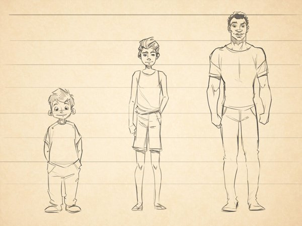

<div style="text-align: center;">
  
</div>

Teenagers seem to prefer to keep to themselves, but they have a wealth of information in their minds. They have so much going on that they rarely focus on the present moment, so any happy moments reported by teenagers can be a springboard into their minds, characterizing their complex inner thoughts and feelings. Here are some of the happy moments reported by people when they were under 20 years of age. Note that they are all 18 or 19 years old, so they are among the most mature teenagers, assuming maturity is correlated with age. All the analysis in this report is based on data from processed_moments.csv, demographic.csv, and senselabel.csv.

```{r import_and_read, include=FALSE}
#set display settings and import dependencies
knitr::opts_chunk$set(echo = TRUE)
options(message = FALSE, warn = -1)
library(reshape2)
library(wordcloud2)
library(topicmodels)
library(textdata)
library(tidyr)
library(ngram)
library(textTinyR)
library(tm)
library(ggplot2)
library(wordcloud)
library(conflicted)
library(dplyr)
library(tidyverse)
library(tidytext)
library(textTinyR)
library(ggplot2)
library(ggrepel)
library(word2vec)
library(udpipe)
library(uwot)
suppressWarnings(tm_map)

#read data
all_moments <- read_csv("../data/processed_moments.csv")
demographic_df <- read_csv("../data/demographic.csv")
sensedf <- read_csv("../data/senselabel.csv")
joined_df <- inner_join(all_moments, demographic_df, by = "wid")
```
```{r data_peek, include=FALSE}
#show some of the data
youngsterdf <- joined_df %>%
  dplyr::filter(age<20 & wid != 2901 & wid != 1244 & wid != 62 & wid %in% c(1280,1222,585,1127))
selected <- select(youngsterdf, age, cleaned_hm)
print(selected)
```
### Question 1 - What do teenagers most associate their happy moments with?
There are 100,392 happy moments reported, and teenagers reported 1465 moments. Since this is roughly 1% of all the moments reported, teenagers comprise a tiny portion of the participants.
```{r count_teens}
#print the number of happy moments for those under 20
under20 <- joined_df %>%
  dplyr::filter(age < 20 & age >= 18)
num_under20 = nrow(under20)
print(num_under20)
```
The moments described are grouped into categories based on their content, and teenagers most frequently experience happy moments in the context of achievement. A significant amount of their happy moments are also related to affection and simply enjoying the moment.
```{r pred_category_teens, include=FALSE}
#process the data before visualizing the prevalent categories for teens
young_adult_hm_df <- joined_df %>%
  dplyr::filter(age < 20 & wid != 2901 & wid != 1244 & wid != 62)
text_ya <- young_adult_hm_df$predicted_category
all_text <- paste(text_ya, collapse = " ")
words_vector <- unlist(strsplit(all_text, " "))
new_ya_corpus <- Corpus(VectorSource(words_vector))
new_ya_corpus <- tm_map(new_ya_corpus, content_transformer(tolower))
new_ya_corpus <- tm_map(new_ya_corpus, removePunctuation)
new_ya_corpus <- tm_map(new_ya_corpus, removeNumbers)
new_ya_corpus <- tm_map(new_ya_corpus, removeWords, stopwords("english"))
new_ya_corpus <- tm_map(new_ya_corpus, removeWords, c("wasnt","sex", "na,", "happy", "good", "great", "enjoyed", "perfect", "taking", "didnt", "wasnt", "day", "nice", "pleasant", "beautiful", "really","actually", "yesterday", "today", "finally", "ive", "mine", "feel", "time", "found"))
dtm <- DocumentTermMatrix(new_ya_corpus)
wfreq <- sort(colSums(as.matrix(dtm)), decreasing = TRUE)
topw <- head(names(wfreq), 20)
topf <- head(wfreq, 20)
maindata <- data.frame(word = topw, freq = topf)
```
```{r vis_pred_teens}
#visualize prevalent categories for teens
ggplot(maindata, aes(x = reorder(word,-freq), y = freq)) +
  geom_bar(stat = "identity", fill = "maroon") +
  labs(title = "Predicted Categories in Teen Happy Moments", x = "Words", y = "Frequency") +
  theme(axis.text.x = element_text(angle = 45, hjust = 1))  + theme(plot.title=element_text(hjust=0.5))
```

When looking further into the their happy moments, we can go beyond grouping teenage happy moments into general predicted categories, and find the specific words that teenagers are thinking about. Notice how teenagers find happiness in contexts like academics, interpersonal relationships, and career, consistent with the predicted categories of achievement, affection, and enjoying the moment. The word cloud below sheds light on the words that describe the topics teenagers think about. Latent Dirichlet Allocation is the topic modeling technique used to find these words.
```{r topic_model_teens, include=FALSE}
num_topics <- 20
young_adult_hm_df$text <- gsub("loose","",as.character(young_adult_hm_df$text))
young_adult_hm_df$text <- gsub("hit","",as.character(young_adult_hm_df$text))
ya_corpus <- Corpus(VectorSource(young_adult_hm_df$text))
ya_corpus <- tm_map(ya_corpus, removeWords, c("wasnt", "na,","time", "happy", "good", "great", "enjoyed", "perfect", "taking", "didnt", "wasnt", "day", "nice", "pleasant", "beautiful", "really","actually", "yesterday", "today", "finally", "ive", "mine","loose"))
```
```{r topic_model}
#visualize topics from LDA as a wordcloud
ya_corpus <- tm_filter(ya_corpus, function(x) length(unlist(strsplit(as.character(x), " "))) > 0)
doctermatrix <- DocumentTermMatrix(ya_corpus)
topic_model <- LDA(doctermatrix, k= num_topics)
#terms(topic_model, 20)
terms_vector <- terms(topic_model)[1:20]
word_freq_df <- data.frame(word = terms_vector, freq = 1)
wordcloud2(word_freq_df, size=0.5, rotateRatio= 0)
```

### Question 2 - What are teenagers feeling during their happy moments?
The sentiments that teenagers express during their happy moments go a long way in revealing what they feel during their happy moments. Using the [AFINN](http://corpustext.com/reference/sentiment_afinn.html) lexicon, a list of terms rated between -5 and 5 to determine how strong of a positive or negative sentiment a word expresses, we can look at what teenagers are saying and how they feel while expressing their happy moments. Teenagers who use express the sentiment "outstanding" during their happy moments notably experienced a positive feeling.
```{r good_sentiment_teens, include=FALSE}
#get sentiments from AFINN lexicon for sentiment analysis and preprocess data
afinn <- get_sentiments("afinn")
tokens <- young_adult_hm_df %>% unnest_tokens(word, text)
sentiment_scores <- tokens %>%
  inner_join(afinn)
word_sentiments <- data.frame(word=sentiment_scores$word, sentiment=sentiment_scores$value)
# Sort the dataframe by the 'value' column in descending order
sorted_sents <- word_sentiments[order(-word_sentiments$sentiment), ]
```
```{r vis_good_teens}
#visualize positive sentiments of teenagers
ggplot(head(sorted_sents, 20), aes(x = word, y = sentiment, fill = factor(sign(sentiment)))) +
  geom_bar(stat = "identity", position = "identity") +
  scale_fill_manual(values = "darkgreen", guide = "none") +
  labs(title = "Strong Positive Sentiments Expressed by Teens", x = "Sentiment", y = "Score")  + theme(plot.title=element_text(hjust=0.5))
```
```{r vis_bad_teens}
#visualize negative sentiments of teens
sorted_badsents <- word_sentiments[order(word_sentiments$sentiment), ]
ggplot(head(sorted_badsents, 20), aes(x = word, y = sentiment, fill = factor(sign(sentiment)))) +
  geom_bar(stat = "identity", position = "identity") +
  scale_fill_manual(values = "darkred", guide = FALSE) +
  labs(title = "Strong Negative Sentiments Expressed by Teens", x = "Sentiment", y = "Value")  + theme(plot.title=element_text(hjust=0.5))
```

The negative sentiments may come as a surprise, but some teenagers may convey a happy moment by framing it in a way that entails avoiding an unhappy situation. 
```{r freq_teen_data, include=FALSE}
#preprocess frequent words in teen happy moments
text_ya <- young_adult_hm_df$text
all_text <- paste(text_ya, collapse = " ")
words_vector <- unlist(strsplit(all_text, " "))
new_ya_corpus <- Corpus(VectorSource(words_vector))
new_ya_corpus <- tm_map(new_ya_corpus, content_transformer(tolower))
new_ya_corpus <- tm_map(new_ya_corpus, removePunctuation)
new_ya_corpus <- tm_map(new_ya_corpus, removeNumbers)
new_ya_corpus <- tm_map(new_ya_corpus, removeWords, stopwords("english"))
new_ya_corpus <- tm_map(new_ya_corpus, removeWords, c("wasnt","time", "na,", "happy", "good", "great", "enjoyed", "perfect", "taking", "didnt", "wasnt", "day", "nice", "pleasant", "beautiful", "really","actually", "yesterday", "today", "finally", "ive", "mine", "feel"))
dtm <- DocumentTermMatrix(new_ya_corpus)
print(dtm)
wfreq <- sort(colSums(as.matrix(dtm)), decreasing = TRUE)
str(wfreq)
topw <- head(names(wfreq), 20)
print(names(wfreq))
topf <- head(wfreq, 20)
maindata <- data.frame(word = topw, freq = topf)
#maindata <- maindata[!duplicated(maindata$word), ]
maindata <- arrange(maindata, desc(freq))
```

The words that teenagers are saying most frequently in their happy moments can add a layer of depth and context to the sentiments they express. The most frequent word by far is "friend," which makes sense because teenagers who report a happy moment are likely to recall enjoyable experiences with friends. Note, however, that the word "friend" may not be what comes to mind when thinking of the major predicted categories of teenage happy moments, like achievement and affection. Perhaps teenagers associate achievement with having many friends. Teenagers also attend events and use words like "game" and "played," which means they experience some happiness from engaging with others.
```{r freq_teen}
#visualize frequent words for teens
ggplot(maindata, aes(x = reorder(word,-freq), y = freq)) +
  geom_bar(stat = "identity", fill = "purple") +
  labs(title = "Top Words and Frequencies in Teen Happy Moments", x = "Words", y = "Frequency") +
  theme(axis.text.x = element_text(angle = 45, hjust = 1))  + theme(plot.title=element_text(hjust=0.5))
```

The word association plot below can reveal more about how teenagers think about things and relate them in their happy moments.
```{r word_assoc_teens, include=FALSE}
#vectorize and preprocess happy moment text for teens
set.seed(123456789)
model <- word2vec(x = head(young_adult_hm_df$text,300), type = "cbow", dim = 15, iter = 20)
embedding <- as.matrix(model)
viz <- umap(embedding, n_neighbors = 15, n_threads = 2)
df  <- data.frame(word = gsub("//.+", "", rownames(embedding)), 
                  xpos = gsub(".+//", "", rownames(embedding)), 
                  x = viz[, 1], y = viz[, 2], 
                  stringsAsFactors = FALSE)
df <- subset(df, word != "mturk" & word != "</s>" & word != "ive")
```
```{r word_assoc_teen_vis}
#plot word associations for teens
ggplot(df, aes(x = x, y = y, label = word)) + 
  geom_text_repel(max.overlaps = 500) + theme_void() + 
  labs(title = "Word Associations from Teen Happy Moments")  + theme(plot.title=element_text(hjust=0.5))
```

### Question 3 - What do middle-aged adults who relate happiness to achievement experience during their happy moments?
I define middle-aged adult as someone aged between 30 and 49 inclusive, which is almost the entirety of the second quarter of their life. I choose this age range because those in their twenties are often considered to be young adults, or even sometimes accused of faking their way into adulthood. Once a person reaches middle age, the assumption is that they know themselves better than they had in any previous age bracket, so they can be seen as more certain about what makes them happy in their happy moments. Since achievements is the most common predicted category of teen happy moments, I focus on the middle-aged adults whose happy moments also have achievements as their predicted category. Achievements is also the among the most common predicted category for adults. These are the adults whom the teenagers whose happy moments are based on achievement are likely to grow to become.

```{r read_mid, include=FALSE}
#preprocess data for adults
firstjoin <- inner_join(all_moments, sensedf, by = "hmid")
secondjoin <- inner_join(firstjoin, demographic_df, by = "wid")
mid_df <- inner_join(all_moments, demographic_df, by = "wid") %>%
  dplyr::filter(age > 29 & age < 50)
result <- secondjoin %>%
  dplyr::filter(predicted_category %in% c("achievement") & age > 29 & age < 50 & POS == "NOUN")
corpus_moments <- Corpus(VectorSource(result$cleaned_hm))
corpus_moments <- tm_map(corpus_moments, content_transformer(tolower))
corpus_moments <- tm_map(corpus_moments, removePunctuation)
corpus_moments <- tm_map(corpus_moments, removeNumbers)
corpus_moments <- tm_map(corpus_moments, removeWords, stopwords("english"))
corpus_moments <- tm_map(corpus_moments, removeWords, "happy")
corpus_moments <- tm_map(corpus_moments, removeWords, "went")
corpus_moments <- tm_map(corpus_moments, removeWords, "good")
corpus_moments <- tm_map(corpus_moments, removeWords, "enjoyed")
corpus_moments <- tm_map(corpus_moments, removeWords, "great")
corpus_moments <- tm_map(corpus_moments, removeWords, "perfect")
corpus_moments <- tm_map(corpus_moments, removeWords, "taking")
corpus_moments <- tm_map(corpus_moments, removeWords, "didnt")
corpus_moments <- tm_map(corpus_moments, removeWords, "day")
corpus_moments <- tm_map(corpus_moments, removeWords, "nice")
corpus_moments <- tm_map(corpus_moments, removeWords, "pleasant")
corpus_moments <- tm_map(corpus_moments, removeWords, "beautiful")
corpus_moments <- tm_map(corpus_moments, removeWords, "really")
corpus_moments <- tm_map(corpus_moments, removeWords, c("wasnt","na,", "got","new","made","today","able", "firstfound", "get", "last", "wonnow", "ive", "felt", "finally", "can", "ago", "one", "found", "time","first", "month", "yesterday", "months","better", "happiness", "</s>"))

#make word cloud for happy moments for adults who care about achievements
doctermatrix <- DocumentTermMatrix(corpus_moments)
matr <- as.matrix(doctermatrix)
wordfreqs <- sort(colSums(matr), decreasing = TRUE)
top_freqs <- head(num(wordfreqs),75)
top_words <- head(names(wordfreqs), 75)
worddata <- data.frame(word = top_words, freq = top_freqs)
```
```{r count_mid}
#print number of happy moments for middle aged adults focused on achievements
print(nrow(mid_df))
```
In the many happy moments that achievement-focused middle-aged adults experience, below are the words they think about most frequently. Naturally, they tend to be career focused.
```{r mid_wordcloud}
wordcloud(words = worddata$word, freq = worddata$freq, scale = c(3, 0.5), colors = brewer.pal(8, "Dark2"))
```
```{r freq_mid, include=FALSE}
#get top words for middle aged adults
top_5_words <- head(top_words, 5)
top_5_freqs <- head(top_freqs, 5)
top_5_words <- factor(top_5_words, levels = top_5_words[order(top_5_freqs, decreasing = TRUE)])
top5data <- data.frame(word = top_5_words, freq = top_5_freqs)
```

As such, the words they most frequently use in their happy moments are related to work, jobs, and money.
```{r plot_mid_freq}
#visualize top words
ggplot(top5data, aes(x = word, y = freq)) +
  geom_bar(stat = "identity", fill = "turquoise") +
  labs(title = "Top Words for Middle Aged Adults Focused on Achievement", x = "Words", y = "Frequency") +
  theme(axis.text.x = element_text(angle = 45, hjust = 1))  + theme(plot.title=element_text(hjust=0.5))
```
```{r mid_sent, include=FALSE}
#perform sentiment analysis using the AFINN lexicon
afinn <- get_sentiments("afinn")
tokens <- result %>% unnest_tokens(word, text)
sentiment_scores <- tokens %>%
  inner_join(afinn)
word_sentiments <- data.frame(word=sentiment_scores$word, sentiment=sentiment_scores$value)
# Sort the dataframe by the 'value' column in descending order
sorted_sents <- word_sentiments[order(-word_sentiments$sentiment), ]
```
Similar to their teenage counterparts, they experience both positive and negative sentiments in their happy moments. Words like "outstanding," "superb," "thrilled," "wonderful," and "fun" are pleasant sentiments expressed during achievement-related happy moments. There is only one example in their negative sentiments because adults use profanity more often than teenagers. For those who are curious, changing the numerical value for head() in the ggplot() function for negative sentiments can reveal some of the negative sentiments middle-aged adults have expressed other than "prick."
```{r mid_good_plot}
#visualize positive sentiments for middle aged adults
ggplot(head(sorted_sents, 600), aes(x = word, y = sentiment, fill = factor(sign(sentiment)))) +
  geom_bar(stat = "identity", position = "identity") +
  scale_fill_manual(values = "darkgreen", guide = "none") +
  labs(title = "Strong Positive Sentiments of Middle Aged Adults Focused on Achievement", x = "Sentiment", y = "Score")  + theme(plot.title=element_text(hjust=0.5))
```
```{r mid_bad_plot}
#visualize negative sentiments for middle aged adults
sorted_badsents <- word_sentiments[order(word_sentiments$sentiment), ]
ggplot(head(sorted_badsents, 1), aes(x = word, y = sentiment, fill = factor(sign(sentiment)))) +
  geom_bar(stat = "identity", position = "identity") +
  scale_fill_manual(values = "darkred", guide = FALSE) +
  labs(title = "Strong Negative Sentiments of Middle Aged Adults Focused on Achievement", x = "Sentiment", y = "Value")  + theme(plot.title=element_text(hjust=0.5))
```
```{r mid_assoc_data, include=FALSE}
#vectorize and preprocess happy moment text for middle aged adults
set.seed(123456789)
model <- word2vec(x = head(result$word, 1000), type = "cbow", dim = 15, iter = 20)
embedding <- as.matrix(model)
viz <- umap(embedding, n_neighbors = 15, n_threads = 2)
## Static plot
df  <- data.frame(word = gsub("//.+", "", rownames(embedding)), 
                  xpos = gsub(".+//", "", rownames(embedding)), 
                  x = viz[, 1], y = viz[, 2], 
                  stringsAsFactors = FALSE)
df <- subset(df, word != "</s>" & word != "mturk" & word != "i")
```

The word association plot below shows how achievement-focused middle aged adults associate the words they use in their happy moments. The clusters are more well defined than the clusters in the word association plot for teenage happy moments presumably because the words are taken from happy moments that share the same predicted category.

```{r mid_word_assoc}
#plot word association
ggplot(df, aes(x = x, y = y, label = word)) + 
  geom_text_repel(max.overlaps = 500) + theme_void() + 
  labs(title = "Word Association Plot for Middle Aged Adults focused on Achievements") + theme(plot.title=element_text(hjust=0.5))
```

```{r mid_topic_data, include=FALSE}
#calculate predicted topic frequencies for middle aged adults
category_extraction_df <- inner_join(all_moments, demographic_df, by = "wid")
achievement_df <- category_extraction_df %>%
  dplyr::filter(predicted_category %in% c("achievement") & age > 29 & age < 50)

bonding_df <- category_extraction_df %>%
  dplyr::filter(predicted_category %in% c("bonding") & age > 29 & age < 50)
enjoy_df <- category_extraction_df %>%
  dplyr::filter(predicted_category %in% c("enjoythemoment") & age > 29 & age < 50)
affection_df <- category_extraction_df %>%
  dplyr::filter(predicted_category %in% c("affection") & age > 29 & age < 50)
exercise_df <- category_extraction_df %>%
  dplyr::filter(predicted_category %in% c("exercise") & age > 29 & age < 50)
nature_df <- category_extraction_df %>%
  dplyr::filter(predicted_category %in% c("nature") & age > 29 & age < 50)
leisure_df <- category_extraction_df %>%
  dplyr::filter(predicted_category %in% c("leisure") & age > 29 & age < 50)
category_sizes <- c(nrow(achievement_df), nrow(bonding_df), nrow(affection_df), nrow(exercise_df), nrow(nature_df), nrow(leisure_df))
categories <- c("achievement", "bonding", "affection", "exercise", "nature", "leisure")
data <- data.frame(categories, category_sizes)
```

Looking more holistically at middle-aged adults, below is the frequency of each predicted category for adults. The main distinction between adults and teenagers in terms of predicted categories is that affection is the most common predicted category for adults, as opposed to achievement for teens. In addition, the most frequent predicted category for teens is significantly more frequent than the second most frequent predicted category, whereas for adults, the first and second most frequent predicted category in their happy moments are close.
```{r mid_topic_plot}
#plot predicted topic frequencies for middle aged adults
ggplot(data, aes(x = reorder(categories,-category_sizes), y = category_sizes)) + 
  labs(title = "Predicted Topic Frequency in Middle Aged Adult Happy Moments", x = "Predicted Topic", y = "Frequency") + theme(plot.title=element_text(hjust=0.5)) +
  geom_bar(stat = "identity", fill = "skyblue")

```

## Conclusions
1. Happiness is relative and context-dependent. As a teenager, achieving good grades may be the greatest source of happiness. As a middle-aged adult, earning a promotion may be the greatest source of happiness. *Both of these are the same.* The adult earning a promotion is not necessarily more or less happy than the teenager who is achieving good grades. In their respective contexts, the strong positive sentiments show that they are both feeling happy, and that is what matters most.

2. When conveying happy moments, people will express negative sentiments. These sentiments can be surprisingly strong. Many reported happy moments show that people experience happy moments when sources of unhappiness are removed.

3. The most significant difference between adults and teenagers is the most frequent category which their respective happy moments fall under. Teenagers are generally focused on achievements when reporting happy moments, whereas adults show significant consideration for affection in addition to achievement.